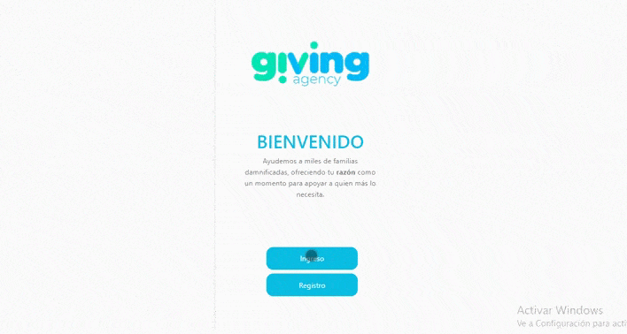

# Crowdfunding peer-to-peer - Giving Agency - Talent Fest | Laboratoria

  

Proyecto creado por las desarrolladoras frontend: [Alejandra Pérez](https://github.com/alefyp), [ Leidy Álvarez](https://github.com/ljohanaalvarez),  [ Alejandra Ibáñez](https://github.com/marialejandraip),  [ Stephanie Hernández](https://github.com/SHB910317), [ Diana Gutierrez](https://github.com/lizguroart), [ Juliana Jimenez](https://github.com/Jimenezo94), guiadas también por los diseños desarrollados por [Gaby Rincón](https://github.com/gabriela-rincon) también desarrolladora.

## Index

* [1.Objetivo del proyecto ](#1-objetivo-del-proyecto)
* [2. Producto final](#2-producto-final)
* [3. Problemática planteada](#3-problematica-planteada)
* [4. Investigación de productos y diseño realizado](#4-UX-research)
* [5. Prototipos e ideas figma](#5-Prototypes)
* [6. Dev tools & stack](#6-Prototypes)

## 1.Objetivo del proyecto
Apoyar y construir los sitios web para iniciativas que aportaran a fundaciones. Buscamos construir redes de apoyo para estas fundaciones y compartir las causas entre grupos de amigos y conocidos. Es una red social que creará una landing page para poder compartir en el caso de algún evento particular y recoger donaciones para una fundación.

## 2. Producto final
Las personas tendrán perfiles donde podrán crear la iniciativa con algún evento particular. Ejemplo un cumpleaños del cual querrán recibir donaciones para una fundación en lugar de algún obsequio. Es una inciativa que mueve y une a las personas bajo una misma causa. 

  

## 3. Problemática planteada
- Las personas se pueden unir con una misma causa y queremos plantear el sitio web para que esto sea posible, buscamos dar la oportunidad a las personas para que apoyen a las fundaciones con las cuales sientan más empatia y con las cuales sientan este deseo de servir, dandoles un sitio web propio y personalizado con todas las descripciones que nos proveen en la red social. 
- Muchas veces no encontramos estos sitio personalizados de esta manera y queremos que sea lo suficientemente amigable a futuro para poder crear la red social de las iniciativas sociales y de servicio. 

## 4. Investigación de productos y diseño realizado

## 5. Prototipos e ideas figma
[Prototipo en Figma](https://www.figma.com/file/28NLXbdkmXi4yiROFqnVqT/Giving-Agency?node-id=0%3A1)
[Wireframe por Giving Agency](figma.com/file/ttDG1n1tHDUKK1qDdeptpd/LABORATORIA)
## 6. Dev tools & Stack

